# Admin in a day

# Module 1: Securing your tenant

# Hands on lab

# Lab Scenario

In this Hands-on Lab, you will be an environment administrator for Contoso helping to adopt the Power Platform. You have been assigned responsibility for ensuring that Contoso&#39;s employees are able to build Power Apps applications and flows using Power Automate to help them be productive. At the same time you are expected to ensure that Contoso&#39;s data and security policies are followed.

Some of Contoso&#39;s employees have already started experimenting with the Power Platform so your first task is to get an understanding of what is already in use.

Next, you will be taking steps to put some baseline security policies in place to implement Contoso&#39;s data and security policies.

# Lab Requirements

## Lab Test Environment

This hands on lab is designed to be completed in an environment setup for multiple students to complete the Admin in a day series of hands on labs.

You will be assigned one or more users to use to complete the tasks. Because this is a shared environment, some tasks that require a tenant Global Administrator or a Service Administrator will already be completed. Your account will only be an environment administrator.

# Exercise 1: Exploring existing Power Platform usage

## Scenario

In this exercise, you will be exploring the tenant to see what Power Platform assets have already been created. Specifically, you will be looking at the following:

- Environments that have been created
- Data Loss Prevention (DLP) policies.

### Task 1: Review existing environments

1. Logged in with the **Lab Admin account** in an in-private browser session. Navigate [https://aka.ms/ppac](https://aka.ms/ppac)and select **Environments**.

2. Review the list of environments. These are the environments that are available for you to manage.

   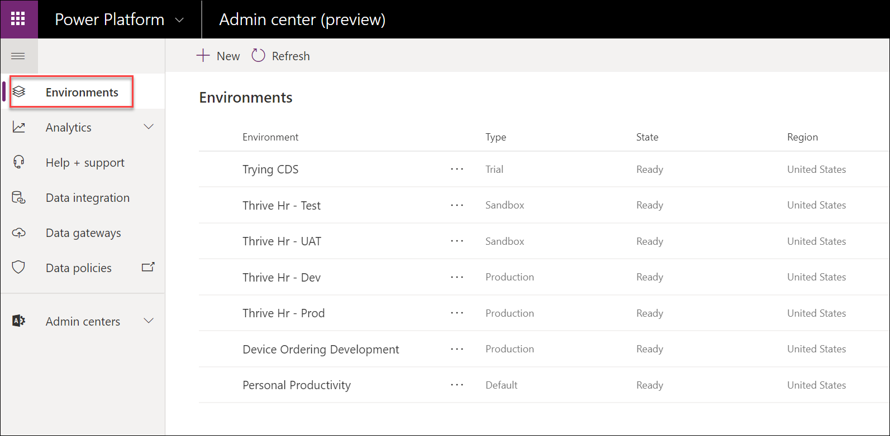

3. Notice the **type column** , you can see Contoso already is using several types of environments.

4. Locate the environments of type **Trial** in the list. These are setup by users trying out building apps and flows and they self-service created a trial environment. They will last for 30 days and can be converted to a Production environment prior to expiration if you wish to keep it longer.

5. Click on the environment name to see the details page. If you click on See All in the right corner it will take you to additional details that include how many days left on the trial.

   

6. Click on Environments to navigate back to the list of environments.

   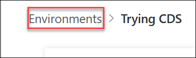

7. Next, notice all the environments with **Thrive HR** in the name. These are a set of environments Contoso uses to manage the lifecycle of their Thrive apps; a suite of employee engagement apps. They are built in Thrive HR - Dev and then are promoted to Test -\&gt; UAT-\&gt; Production after testing by your admin team.

8. Locate the environment with a type of **Default**. This is the environment in which all users are makers and can build their own apps and flows. Think of this environment as supporting personal productivity use of the platform. This is also the default location used by any customizations built with Power Apps in Office apps. The Default environment can&#39;t be deleted, but you can rename it to make it clear its purpose. For example, some name it Personal Productivity like we have in this tenant.

### Task 2: Review existing Data policies

1. Navigate to the admin portal [https://aka.ms/ppac](https://aka.ms/ppac) or [https://admin.powerplatform.microsoft.com](https://admin.powerplatform.microsoft.com/)

2. Select **Data policies** on the left navigation.

3. Review the list of existing policies.

  - As the login you are using is not a tenant admin but only an environment admin, you will see policies that impact environments of which you are a member.

  - As an environment admin or regular environment user, you will also be able to see any tenant-wide DLP policies applied to your environment. However, you would not be able to edit those tenant-side DLP policies.

  - As a tenant admin in your production tenant you will also see the policies that exist for any environments, even those that you are not explicitly added as an environment admin.

4. You will also notice a DLP for **Thrive Exceptions**. That team had worked with your IT department to agree on exceptions they need for their environment and their environment would be excluded from the Contoso Global DLP.

   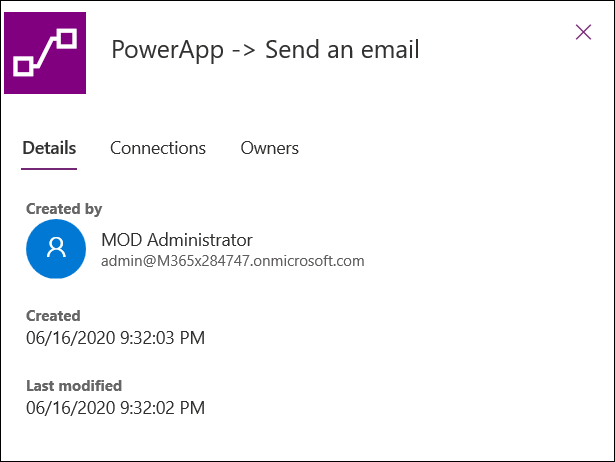

5. Select the **Global DLP** and click **Edit Policy**.

   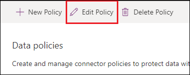

6. Select **Connectors** and review the **Business** connectors.

   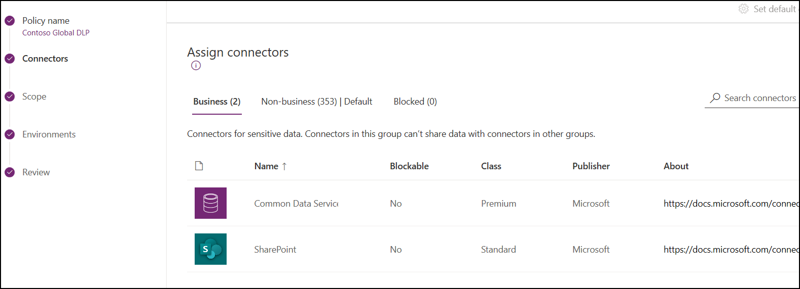

7. Select **Data Policies** again.

8. Select the **Thrive DLP** and click **View Policy**.

9. Click on the **Connector** and select the **Business** tab. Notice it copied Common Data Service and SharePoint being in the Business data only from the normal global policy and it added Microsoft Teams, Office O365 Outlook and Office 365 Users.

   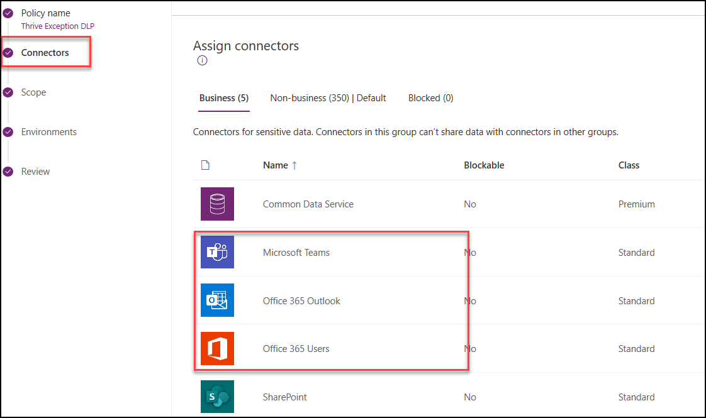

# Exercise 2: Explore a team development environment

## Scenario

In this exercise, you will be reviewing one of the environments used by a team building an internal device ordering app. The app was built in this environment and you will help them in a later lab deploy to a test and production environment. Unlike the Thrive application that has its own test and production environment, we will deploy this application to a shared environment of multiple Contoso apps named Central Apps. There is still test and production, they are just shared by other small apps that Contoso is building.

### Task 1: Review the Device Ordering Dev environment detail

In the prior exercise you saw how from the admin portal you could look at the canvas apps and flows that people built for their own personal productivity. The team building the device ordering app is using Common Data Service to store the app data and has built multiple Power Apps and Power Automate flows. These resources are tracked as part of a solution and the solution is what you will export to transport the application resources to test and production.

In this task, you will check out one of the Power Apps the team built as well as exploring the solution that contains all the resources for the app.

1. Navigate to[**https://make.powerapps.com**](https://make.powerapps.com/) - This is where app makers build the solution, but can also provide a wealth of information for administrators.

2. Click on the environment selector in the upper right corner of the page.

   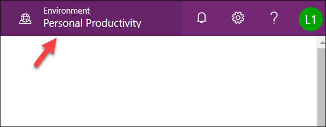

3. In the list of environments select **Device Ordering Development** environment.

   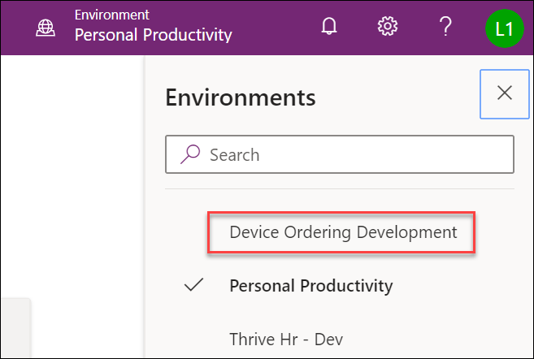

4. Select **Solutions** in the left navigation. Solutions are containers that track Power Platform resources and allow you to transport (export/import) them into other environments as a group of assets.

   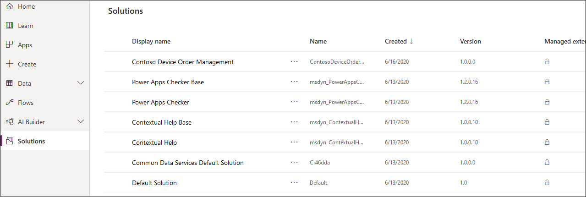

Review this list and notice that there are three solutions. Default and Common Data Service Default Solution are in every environment. The Contoso Device Order Management Solution is one created by the team to track their app resources.

5. Click on the **Contoso Device Order Management** solution to open it.

6. Review the contents of the solution, notice there are several types of components tracked by the solution, including CDS entities, Power Apps and Power Automate flows.

   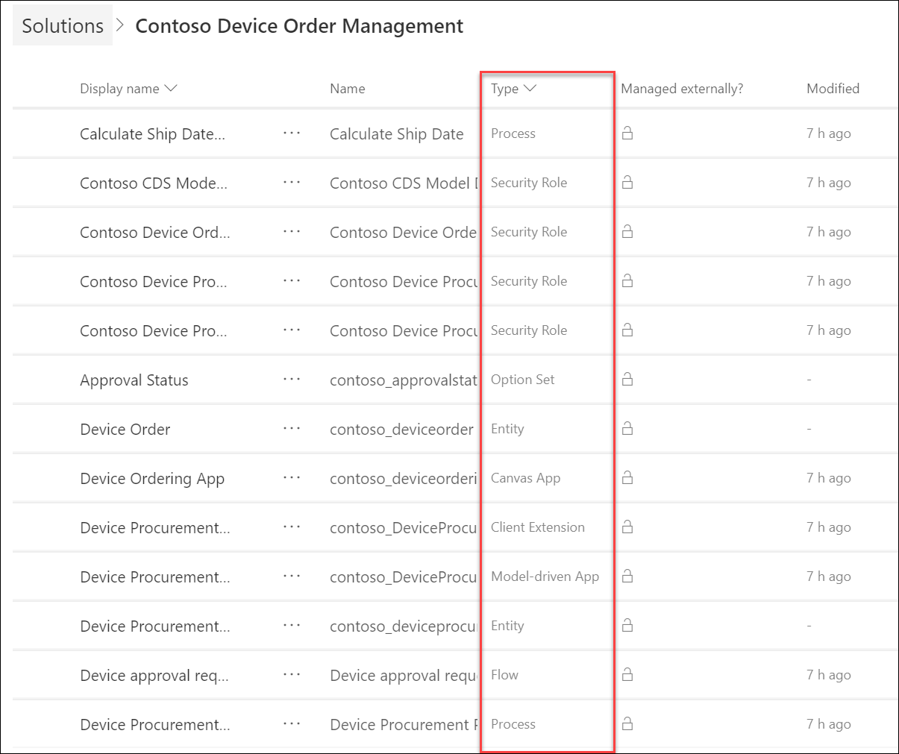

7. Click on the … next to **Device Ordering App** – Review the actions available, and then click Play which will run the app

   

8. Because this is your first run, you will see a permission dialog for the connectors used by the app. Click Allow to proceed.

   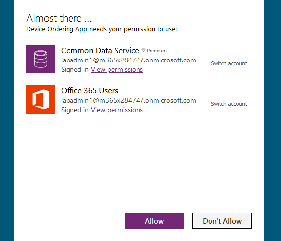

9. The app will open in a new browser tab; briefly review the app. This is a Power Apps canvas app. After reviewing close the browser tab.

10. Back on the list of solution components select … on the Device Ordering App again and this time click the **Details**. Here you can review the versions of the app, what connections are used, and the flows it uses.

    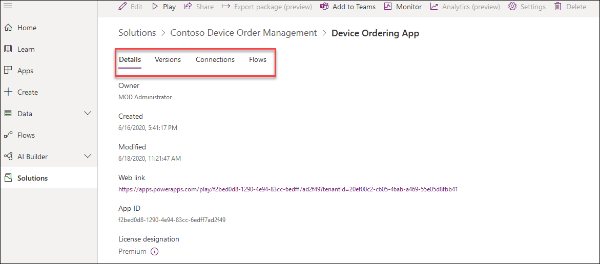

11. Click the browser back button to return to the solution component list.

12. Click the … next to the **Device Procurement** that has a type of Model-driven App and select Play. This will launch the app designed for the back-office users, it is a PowerApps model-driven app.

    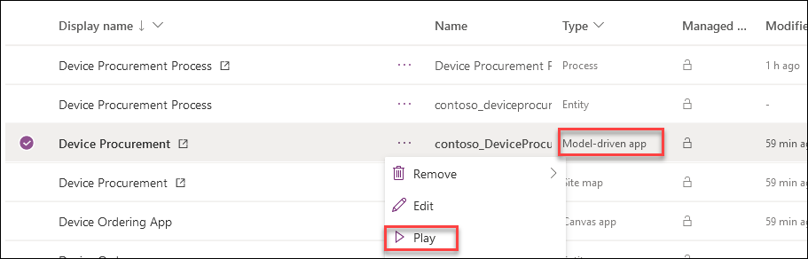

13. After a moment reviewing the app, close the browser tab to return to the solution list. Stay here as you will start from this location in the next task.

14. Notice this is a well-controlled development environment and no one is creating test apps like in default. These are all purpose built to support the device ordering solution.

### Task 2: Review the Security Roles

In this task, you will be reviewing the security roles that the Device Order Management app team put together. Security roles define the privileges a user has to access CDS data and services. As an admin it is important that you review security roles to ensure they aren&#39;t creating broader access to data that is shared with other apps unintentionally.

In a future hands on lab you will be assigning the security roles you review here to users and teams that need to use the apps. You can read more about security roles and privileges [here](https://docs.microsoft.com/en-us/dynamics365/customer-engagement/admin/security-roles-privileges).

Working with the team you identified that there are three different usage patterns for the app, and you asked the team to create the following security roles:

- **Contoso Device Order App** - this defines the permissions for all employees that will run the canvas app used to place a device order. This is the most restrictive role as they only need the ability to create a device request.
- **Contoso Device Procurement App** - this defines the permission of the back office staff that process the employee device requests, work with device vendors, and finally configure and deliver the device to the requestor. This role provides the ability to work with all device request records regardless of which user placed the order.
- **Contoso Device Procurement Flow SP** - this role is to support the access needs of the automated flow that runs on create of the device request. In a future HOL, we will be creating a special type of app user (a service principal) that will use this role to ensure least privileged access to CDS by the executing flow.

One additional role (Contoso CDS Model Driven User) was created. This role is designed to have just the base permission any user needs to login to a CDS model driven application. It is similar to the Common Data Service User security role. In fact, it was copied from that and modified. This role, unlike the default one that comes with CDS, does not have access to any business data like Account and Contacts. This role is designed to be used with the app roles like Contoso Device Order app and allows the app roles to be built without including all the base permissions required to login to a CDS model-driven app. When we assign roles to users in a future HOL we will give the user this role plus the app role. When combined, these two roles will give them the privileges needed to run the app.

1. From the list of solution components on the Contoso Device Order Management Solution.

2. Filter on **Other**.

   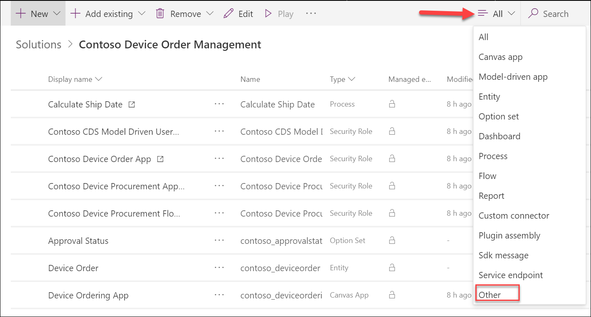

3. Click to open the **Contoso CDS Model Driven User** security role.

4. Select the Core Records tab and review it. Don&#39;t make any changes. Locate the Account and Contact rows and make sure none of the circles have been granted access to the data. An empty place means it isn&#39;t granting access.

   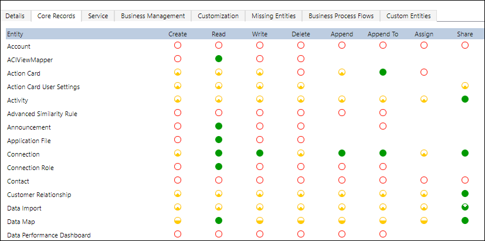

5. Review the rest of the tabs.

6. Close the security role browser tab without saving.

7. Click **Done**.

8. Review both **Contoso Device Order App** and **Contoso Device Procurement App** security roles and close them without making any changes.

9. Click to open the **Contoso Device Procurement Flow SP**.

10. Select the **Core Records tab**.

11. Click on the **Read** circle of the Account entity 4 times. The circle will become green/filled in. Each click progressively grants more access.

    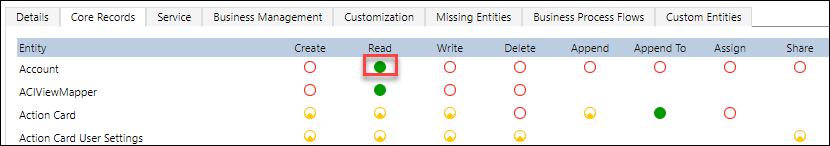

12. Look at the **Key** section and review the different security levels. When reviewing security roles with the developers you should talk through any security role that grant full organization level access. If this is done on an entity shared by another application it could result in bypassing limited access to that data. Security roles for users should be looked at in the context of all applications installed in the environment and the sensitivity of the data.

    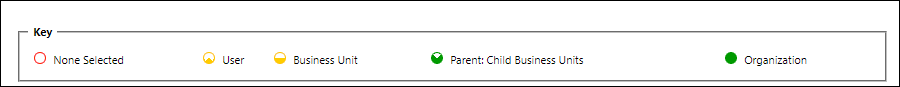

13. We are not going to save our changes we made, so Close the security role browser tab without saving.

14. Click **Done**.

# Terms of Use

© 2020 Microsoft Corporation. All rights reserved.

By using this demo/lab, you agree to the following terms: The technology/functionality described in this demo/lab is provided by Microsoft Corporation for purposes of obtaining your feedback and to provide you with a learning experience. You may only use the demo/lab to evaluate such technology features and functionality and provide feedback to Microsoft. You may not use it for any other purpose. You may not modify, copy, distribute, transmit, display, perform, reproduce, publish, license, create derivative works from, transfer, or sell this demo/lab or any portion thereof. COPYING OR REPRODUCTION OF THE DEMO/LAB (OR ANY PORTION OF IT) TO ANY OTHER SERVER OR LOCATION FOR FURTHER REPRODUCTION OR REDISTRIBUTION IS EXPRESSLY PROHIBITED. THIS DEMO/LAB PROVIDES CERTAIN SOFTWARE TECHNOLOGY/PRODUCT FEATURES AND FUNCTIONALITY, INCLUDING POTENTIAL NEW FEATURES AND CONCEPTS, IN A SIMULATED ENVIRONMENT WITHOUT COMPLEX SET-UP OR INSTALLATION FOR THE PURPOSE DESCRIBED ABOVE. THE TECHNOLOGY/CONCEPTS REPRESENTED IN THIS DEMO/LAB MAY NOT REPRESENT FULL FEATURE FUNCTIONALITY AND MAY NOT WORK THE WAY A FINAL VERSION MAY WORK. WE ALSO MAY NOT RELEASE A FINAL VERSION OF SUCH FEATURES OR CONCEPTS. YOUR EXPERIENCE WITH USING SUCH FEATURES AND FUNCTIONALITY IN A PHYSICAL ENVIRONMENT MAY ALSO BE DIFFERENT.

## FEEDBACK

If you give feedback about the technology features, functionality and/or concepts described in this demo/lab to Microsoft, you give to Microsoft, without charge, the right to use, share and commercialize your feedback in any way and for any purpose. You also give to third parties, without charge, any patent rights needed for their products, technologies and services to use or interface with any specific parts of a Microsoft software or service that includes the feedback. You will not give feedback that is subject to a license that requires Microsoft to license its software or documentation to third parties because we include your feedback in them. These rights survive this agreement. MICROSOFT CORPORATION HEREBY DISCLAIMS ALL WARRANTIES AND CONDITIONS WITH REGARD TO THE DEMO/LAB, INCLUDING ALL WARRANTIES AND CONDITIONS OF MERCHANTABILITY, WHETHER EXPRESS, IMPLIED OR STATUTORY, FITNESS FOR A PARTICULAR PURPOSE, TITLE AND NON-INFRINGEMENT. MICROSOFT DOES NOT MAKE ANY ASSURANCES OR REPRESENTATIONS WITH REGARD TO THE ACCURACY OF THE RESULTS, OUTPUT THAT DERIVES FROM USE OF DEMO/ LAB, OR SUITABILITY OF THE INFORMATION CONTAINED IN THE DEMO/LAB FOR ANY PURPOSE.

## DISCLAIMER

This demo/lab contains only a portion of new features and enhancements in Microsoft PowerApps. Some of the features might change in future releases of the product. In this demo/lab, you will learn about some, but not all, new features.
