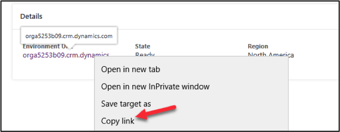
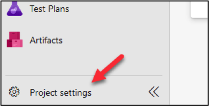
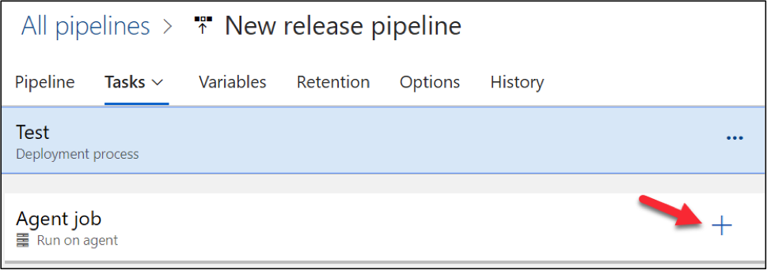
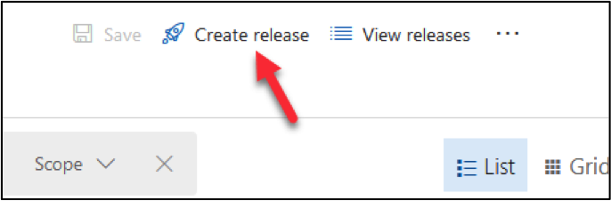
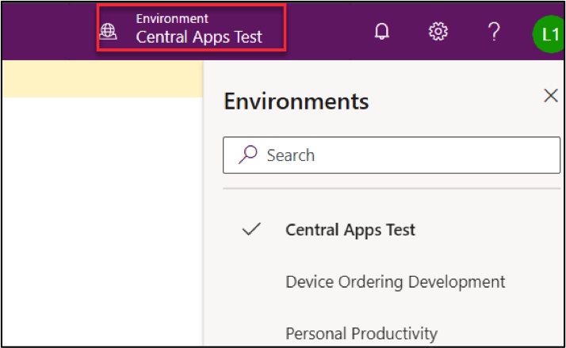
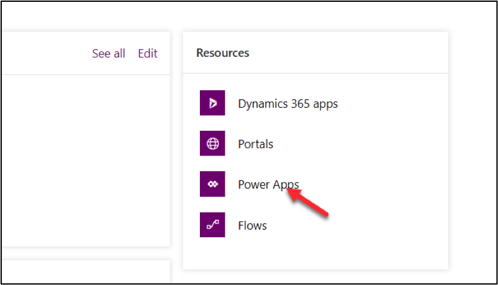

# Admin in a day

# Module 4: Application Lifecycle Management and Deploying Apps

# Hands on lab

# Lab Scenario

In this Hands-on Lab, you are an administrator for Contoso, helping them to adopt the Power Platform.

The team building the Device Order Management app is now ready for you to transport their solution from their development environment to the test environment for testing.

In this lab, you will be using Azure DevOps and the Power Apps build tools to automate checking their solution into a source control repository and then using that to deploy to test and production.

Because this is the first deployment to test, you will have to do some setup to configure security for users to be able to access the app.

# Lab Requirements

## Lab Test Environment

This hands-on lab is designed to be completed in an environment setup for multiple students to complete the Admin in a day series of hands-on labs.

You will be assigned one or more users to use to complete the hands-on tasks. Because this is a shared environment, some tasks that require a tenant Global Administrator or a Service Administrator will already be performed.

This lab assumes you have completed M03_Automation prior to starting this lab.  In that lab you would have created the environment that you will deploy to in this lab.

# Exercise 1: Initialize Azure DevOps

In this exercise, you will be signing up for an Azure DevOps account and configuring the PowerApps build tools for the account.

**Note**:  If you already have Azure DevOps outside of this course and this environment, you CANNOT use that here.  You will need to follow our instructions to sign up.

### Task 1: Signup for Azure DevOps

1)	Navigate to https://dev.azure.com and click Sign in to Azure DevOps.  

**Note**: Use the same account you have been using for the other labs.

2)	Provide your credentials and click **Next**.

3)	Provide a **Password** and click **Sign in**.

4)	Click **Continue**.

5)	Click **Continue**.

6)	If prompted, provide a unique **Azure DevOps Organization** name such as lastnameMMYY, select a location closest to your tenant, enter captcha and click **Continue**. Replace lastname with your last name, MM current month and YY current year.

7)	Enter **Device Management lastnameMMYY** for **Project Name** and click **Create**. Replace lastname with your Last name, MM with current month, and YY with current year.

Projects are containers in Azure DevOps that track work items and source assets. When you set up the automation for the deployment tasks those will be pipelines built in the context of a project.

8)	Select **Repos**.

An Azure Repo is a source/version control container inside the Azure DevOps project used to track changes you make.  You will be using it to store the solution files for the team building the Device Ordering app.

9)	Check the **Add a Readme** checkbox and click Initialize.

### Task 2: Configure Power Platform Build Tasks

1.	Navigate to https://marketplace.visualstudio.com/azuredevops 

2.	Search for **Power Platform**.

3.	Select **Power Platform Build Tools**.

4.	Click **Get it Free**.

5.	Select the **Azure DevOps organization** you created and click **Install**.

6.	Click **Proceed to Organization**.

7.	Click to open the **Device Management** project you created.

# Exercise 2: Build Export Pipeline

In this exercise, you will build an Azure DevOps pipeline that will export the solution from the development Common Data Service environment, unpack the solution file to individual files and then check those files into the repository.  These solution files can be then used to re-create development environments or to promote the solution to test/production. 

### Task 1: Export Solution

1.	Create a Build Pipeline.

      a. Click to expand **Pipelines**.
      
      
      
      b.	Select **Pipelines**.
      
      
      
      c.	Click Create **Pipeline**.
      
      
      
      d.	Click **Use the Classic Editor**.
      
      
      
      e.	Do not change the default values and click **Continue**.
      
      
      
      f.	Select **Empty Job**.
      
      
      
      g.	Click **Save and Queue** and select **Save**.
      
      
      
      h.	Click **Save**.
      
      
      
2.	Add PowerApps Tool Installer task.

    **Note**: The Power Platform Tool Installer needs to be run before any other Power Platform build tasks.

      a.	Click **+ Add Task to Agent Job 1**.
      
      
      
      b.	Search for **Power Platform** hover over select **Power Platform Tool Installer** and click **Add**.
      
      
      
3.	Add Power Platform Export Solution task.
      
      a.	Search for **Export**.

      b.	Hover over **Power Platform Export Solution** and click **Add**.
      
      
      
4.	Open Power Platform Export Solution.

      a.	Select the **Power Platform Export Solution task**.
      
      
      
5.	Get your development environment URL
      
      a.	Start a new browser window or tab and navigate to https://aka.ms/ppac

      b.	Select **Environments** and click to open the **Device Ordering Development** environment.
      
      c.	Copy the **Environment URL** and keep it in your clipboard or you can keep this URL on a notepad.
      
      
      
      d.	Close the **Power Platform Admin** browser window or tab.
      
6.	Create a Generic Service Connection.  Service Connections are how the build tasks know what environment URL and user credentials to use to access the Common Data Service environments.

      a.	Go back to the **Pipeline**.

      b.	Make sure you still have the **Power Platform Export Solution** task selected.

      c.	Click **Manage**.
      
      
      
      d.	Click Create Service Connection.
      
      
      
      e.	Select Generic and then click **Next**.
      
      
      
      f.	Provide a **Connection Name**, paste the **Environment URL** you copied, provide your credentials, and click **Save**.
      
      
      
      g.	Close the **Service Connections** browser window or tab.

7.	Select the Generic Service Connection you created as the Power Apps Environment URL.
      
      a.	Go back to the **Build Pipeline** tasks and make sure you still have PowerApps Export Solution task selected.

      b.	Locate the **Service Connection** field and click **Refresh**.
      
      
      
      c.	Select the **Generic Service Connection** you just created named Dev Connection.
      
      
      
      d.	Enter **$(SolutionName)** for **Solution Name**, **$(Build.ArtifactStagingDirectory)\$(SolutionName).zip** for Solution Output File.
      
      
      
      e.	Click **+Add Task**.
      
      
      
      f.	Add another **Export Solution** task.
      
      
      
      g.	Select **Dev Connection** for the PowerApps Environment URL.

      h.	Check the Export as Managed Solution.

      i.	Enter **$(SolutionName)** for **Solution Name**, **$(Build.ArtifactStagingDirectory)\$(SolutionName)_managed.zip** for **Solution Output File**
      
      
      
8.	Add an Unpack task. This task will take the solution zip file and expand it into a file for each solution component.
      
      a.	Click **+ Add Task**.
      
      
      
      b.	Search for **Unpack**.

      c.	Hover over **PowerApps Unpack Solution** and click **Add**.
      
      
      
9.	Provide Unpack settings information.

      a.	Select the **Unpack** task.

      b.	Enter **$(Build.ArtifactStagingDirectory)\$(SolutionName).zip** for Solution **Input File**, **$(Build.SourcesDirectory)\$(SolutionName)** for **Target Folder**.

      c.	Choose **Both** for Type of Solution.
      
      
      
10.	Allow scripts to access the OAuth Token. This will allow the commands you will add to check in files to the Azure DevOps repo to work.

      a.	Select **Agent Job 1**.
      
      
      
      b.	Scroll down and check the **Allow Scripts to Access the OAuth Token** checkbox.
      
      
      
11.	Add Command Line task.

      a.  Click **+ Add a Task**.
      
      
      
      b.	Search for **Command Line**.
      
      c.	Hover over **Command Line** and click **Add**.
      
      
      
12.	Add Scripts to the Command Line task.  This task will be used to check in the solution file changes to the repo.
      
      a.	Select the Command Line task.
      
      
      
      b.	Paste the script below in the **Script** text area. Replace **user@myorg.onmicrosoft.com** with your username.
      
echo commit all changes

git config user.email "user@myorg.onmicrosoft.com"

git config user.name "Automatic Build"

git checkout master

git add --all

git commit -m "solution updates"

echo push code to new repo

git  -c http.extraheader="AUTHORIZATION: bearer $(System.AccessToken)" push origin master

 
   
     
      
13.	Add Solution Name variable.
      
      a.	Select the **Variables** tab.

      b.	Click **+ Add**.
      
      
      
      c.	Enter **SolutionName** for **Name** and **ContosoDeviceOrderManagement** for Value. Confirm that there are no extra spaces at the end of the value after pasting.
      
      
      
      d.	Click **Save and Queue** and select **Save**.

      e.	Click **Save** again.
      
# Exercise 3: Test the Pipeline

In this exercise, you will test the build pipeline you created.

### Task 1: Run the Pipeline

1.	Open the build pipeline.
      
      a.	Navigate to https://dev.azure.com/ and click to open the **Device Management** project.
      
      
      
      b.	Select **Pipelines | Pipelines**.
      
      
      
      c.	Click **Device Management-youruser-CI**.
      
      
      
      d.	Click **Run Pipeline**
      
      
      
      e.	 Select **Run** again and wait.
      
      
      
      f.	Refresh the screen until your Agent job 1 has a Status of **Running**.
      
      
      
      g.	Click on **Agent job 1** to open the job
      
      h.	The build will run up to the Command Line Script and fail because we need to adjust permissions. The first run causes a project specific build service user to be added,           we will adjust the permissions to fix this problem.
      
      
      
      i.	Click **Project Settings** in the lower left corner.
      
      
      
      j.	Select **Repositories**.
      
      
      
      k.	Select the **Permissions** tab.
      
      l.	In the **Users** section, select the **Device Management Build Service** user.
      
      
      
      m.	In the **Access Control Summary**, locate **Contribute** and change it to **Allow**.
      
      
      
      n.	Select **Pipelines | Pipelines** in the left navigation
      
      o.	Click to open the failed run.
      
      
      
      p.	Click **Run Pipeline**.
      
      
      
      q.	Click **Run** and wait
      
      r.	Click to open the job.
      
      
      
      s.	The job should now run successfully
      
      
      
2.	Review the Repository.
      
      a.	Select Repos.
      
      
      
      b.	You should see **ContosoDeviceOrderManagement** folder. Click to open the folder.
      
      
      
      c.	The content of the folder should look like the image below.
      
      
      
      d.	You may examine the content of the folders.
      
# Exercise 4: Build Manage Solution and Publish Artifacts

In this exercise, you will take the solution files checked into the repo in the prior steps and re-package them into a managed solution file.  This solution file will be published as a build artifact so it can be used in the release pipeline we are going to use to publish to test and production.

In a real project this is where you could add steps to import the solution into a build Common Data Service environment to check for missing dependencies.  You could also add build tasks to run tests against your solution as well as run Power Apps Solution Checker to detect problems.  In this lab exercise we will skip those extra steps to ensure you have enough time to complete the lab.

### Task 1: Build the Managed Solution

1.	Select **Pipelines**, click **New Pipeline**.

2.	Click **Use Classic Editor**

3.	Click **Continue**.

4.	Click **Empty Job**.

5.	Enter **Build Managed Solution** for **Name**, click **Save and Queue** and select **Save**.

6.	Click **Save** again.

7.	Click **Add a Task to Agent Job 1**.

8.	Search for **Power Platform Tool**, hover over **Power Platform Tool Installer** and click **Add**.

9.	Search for **Power Platform Pack**, hover over **Power Platform Pack Solution** and click **Add**.

10.	Select the **Power Platform Pack Solution** task.

11.	Enter **$(Build.SourcesDirectory)\$(SolutionName)** for **Source Folder of Solution to Pack**, enter **$(Build.ArtifactStagingDirectory)\$(SolutionName).zip** for **Solution Output Folder**.

12.	Change the solution type to **Managed**

13.	Select the **Variables** tab and click **+ Add**.

14.	Enter **SolutionName** for Name and **ContosoDeviceOrderManagement** for **Value**.

15.	Navigate back to **Tasks**.

16.	Click **Add a Task**.

17.	Search **Publish Pipeline**, hover over **Publish Pipeline Artifact** and click **Add**.  Publishing the solution as an artifact will make it available for the release pipeline you will build

18.	Select the **Publish Pipeline Artifact** task.

19.	Enter **$(Build.ArtifactStagingDirectory)\$(SolutionName).zip** for ***File or Directory Path** and enter **drop** for **Artifact Name**.

20.	Click **Save and Queue** and select **Save and Queue**.

21.	Click **Save and Run**.

22.	Refresh the page until Agent Job 1 has a status of **Running**

23.	Click on **Agent job 1** and wait for the run to complete. Build tasks should run and succeed.

24.	Click on **1 artifact produced**

25.	Expand the folder and you should see the managed solution.

# Exercise 5: Build a Release Pipeline

In this exercise, you will build your release pipeline. The release pipeline is intended to take the output from the build pipeline and coordinate deploys to one or more release environments.  A common release pipeline might deploy to dev -> test -> user acceptance -> production.  Release pipelines can have approval requirements between each environment.

For the purposes of this lab we are only going to deploy to one test environment.  For the purposes of this lab, we will be using the Central Apps Test trial environment we created in the previous lab. In real use, you would deploy to both Test and Production and would use environments of type production instead of trial.

### Task 1: Create Connection and Release to Prod

1.	Go back to Azure DevOps 

2.	Click to open the **Device Management** project.

3.	Click **Project Settings**.

4.	Go to the **Pipelines** area and select **Service Connections**.

5.	Click **New Service Connection**, select **Generic**, and click **Next**.

1.	In a new tab, navigate to https://aka.ms/ppac 

2.	Select **Environments** and locate your **Central Apps Test** environment you created in the prior lab.

3.	Click on the environment name to show the details, and then copy the **URL** from the detail screen.

6.	Enter **Test** for **Connection Name**, paste the **Environment URL** copied in the previous step, provide your credentials, and click **Save**.

7.	Select **Pipelines** -> **Releases**.

8.	Click **New Pipeline**.

9.	Select **Empty Job**.

10.	Enter **Test** for **Stage Name** and click **+ Add Artifacts**.

11.	Select **Build Managed Solution** for **Source** and click **Add**.

12.	Select the **Tasks** tab and click + **Add Task**.

13.	Search for **Power Platform Tool**, hover over **Power Platform Tool Installer** and click **Add**.

14.	Search for **Power Platform Import**, hover over **Power Platform Import Solution** and click **Add**.

15.	Select the **Power Platform Import Solution** task.

16.	Select the **Test** connection for Environment and enter **$(System.DefaultWorkingDirectory)/_Build Managed Solution/drop/$(SolutionName).zip** for **Solution Input File**.

17.	Select the **Variables** tab and click **+ Add**.

18.	Enter **SolutionName** for **Name**, **ContosoDeviceOrderManagement** for **Value**, and click **Save**.

19.	Click **OK**.

20.	Click **Create Release**

21.	Click **Create**.

22.	Select **Releases** and click to open the release.

23.	Wait for the release tasks to complete. The release pipeline should succeed.

If your Release has succeeded, go to to Step 27
If your Release has failed, try: 

A common error here is the import fails because the Solution file is not found – one of the reasons for this could be that you have named your pipeline different to what’s written in the lab.

A fix for this is to manually select the solution file for the import. To do click on **Edit → Edit Pipeline**

Select the **Test Task**

. Select **PowerApps**

**Import Solution**

Select the … next to **Solution Input File**

Select the .zip file in the drop folder and confirm with OK

Go back to Releases and click **Create Release and Create**

24.	Navigate to https://make.powerapps.com and select the **Test** environment **Central Apps Test**.

25.	Select **Solutions**. You should see the managed solution you published from the release pipeline.

26.	Click to open the **Contoso Device Order Management** solution.

27.	You should get the **You cannot edit managed** solution message.

28.	Select Apps. You should see **Device Ordering App** Canvas application and **Device Procurement** Model-Driven-Application.

# Exercise 6: Share the apps with the users

## Scenario

In this exercise, you will be sharing the Device Ordering canvas app with all users of the Device Ordering App Azure AD security group (we pre-created this for you!). When you do the share, you will pick the Device Ordering App security role for the CDS permissions. Behind the scenes this will cause the system to create a CDS team that is associated with the Azure AD group and associate that team with the security role. The end result of this is making it possible to give users access to the app and CDS data all in the same sharing action.

### Task 1: Share the device ordering app

1.	Navigate to https://aka.ms/ppac 

2.	Select **Environments** and click to open the **Central App Test** environment.

3.	Go to the **Resources** section and click to open **Power Apps**.

4.	Click on the … More Commands button on the **Device Ordering App** and select **Share**.

4.	Search for **Device** and select the **Device Ordering App** group.

5.	On the right side of the share panel next to the CDS Connector click on the Assign a security role dropdown and select the **Contoso CDS Model Driven User** and **Contoso Device Order App** security roles. The system will create a CDS Team and assign this security roles to the team. Any member of the Azure AD Group will then get those privileges.

6.	Un-check the **Send Notification** checkbox and click on the **Share** button.

7.	Do not close the share pane we are going to use it in the next task.

### Task 2: Share the device procurement model-driven app

While you can click on the Share link of a model-driven app it will simply list the manual steps you need to take. These steps are the following * Make sure the model-driven app has a security role assigned to it, and users that need to run it has that role * Make sure the users that need to access the app have a security role giving them appropriate CDS permissions to the data.

In the future, the model-driven share experience will be updated to be more like the canvas experience above. Until that happens, we can leverage the canvas share to do the connection of an Azure AD group to a CDS Team. In our example, we want the back office group to also have access to our canvas app, but if we didn’t after using the share to hookup the team and the security role to the Azure AD group we could remove the share to this group and it would leave the team and connection to Azure AD in place.

1.	While still on the share pane from the prior task, search for the **Device Procurement App** group and select it.

2.	In the Assign security role drop down select the **Contoso CDS Model Driven User** and **Contoso Device Procurement App** security roles.

3.	Un-check send an email and click Share. Since our model-driven app uses the Contoso Device Procurement App role, our back-office users will now have access to the model-driven app.

4.	Close the share pane.
 

# Exercise 7 (Optional): Test the application

## Scenario

In this exercise, you will login with the users and test the application.

### Task 1: Test the Device Ordering app

1.	Navigate to https://make.powerapps.com/ and make sure you are in the **Central Apps Test** environment.

2.	Select on **Apps**.

3.	Click on … next to the **Device Ordering App** and select **Details**.

4.	On the details page copy the URL in the Web link section.

5.	In another in-private browser window, paste the copied URL into the browsers address bar to launch the app.

6.	Log in with your Lab Employee account.

7.	Make sure the selected connections are correct and click Allow.

8.	Select Manufacturer.

9.	Select Few devices and click Compare.

10.	Select one of the devices.

11.	Change the approver to your lab admin account.

12.	Provide a comment and click **Submit Device Request**.

13.	Click OK.

### Task 2: Test the Device Procurement app

1.	In the browser window logged in with Lab Admin, navigate to https://aka.ms/ppac and click to open the **Central Apps Test** environment.

2.	Go to the **Resources** section and click to open **Power Apps**.

3.	Click … next to the ***Device Procurement App** and select **Share**.

4.	Copy the **URL** from step **4**.

4.	In a private browser window paste the URL for the app into the address bar and login with your Lab Back Office account. If you cannot login, give few minutes and try again.

5.	Select **Device Orders** and you should see at least one device order.

#  Exercise 8 (Optional): Setup the flow to use a service principal

## Scenario

In this exercise, you will be setting up the Power Automate flow to use a service principal and shared service accounts.

The goal of this setup is to ensure the flow runs in a non-system admin account with the least privileges required.

To accomplish that the following accounts will be used * For Common Data Service trigger and actions we will use a service principal that has just the permissions required for the flow actions * For the Approval and Office 365 e-mail send we will use a Service Account that only has permission to send e-mail and has no other permissions at this time.

The most important thing is to make sure we don’t use our admin account that generally has very broad access to resources in the tenant.

### Task 1: Setup the service principal

1.	Navigate to https://portal.azure.com/ 

2.	Search for **azure active directory** and click to select it.

3.	Select **App Registration** and click New Registration.

4.	Enter **Device Procurement App (Your Initials)** for **Name**, select **Accounts in this Organizational Directory Only**, and click **Register**.

5.	Copy the **Application(client) ID** and **Directory Tenant ID**. Save them in a notepad.

6.	Select **Certificates & Secrets** and click **+ New Client Secret**.

7.	Enter **Description** and **click Add**. For the Expires duration, we are choosing 1 year, in a real deployment you need to make sure if you choose 1 or 2 years you have a plan to rotate the keys prior to expiration or anything using the key will fail upon expiration.

8.	Copy the **Value** and keep in a notepad. This value is not available again once you leave this area of the portal.

9.	Go back to https://make.powerapps.com click **Settings** and select **Advanced Settings**.

12.	Navigate to ***Settings | Security**.

13.	Click **Users**.

14.	Change the view to Application Users.

15.	Click **New**.

16.	Change the form to **Application User**.

17.	Enter **Contoso App User** for **Name**.

18.	Paste the **Application ID** you copied from the Azure Portal.

19.	In the **Full Name** field, provide **First** and **Last Name** and then click **Done**.

20.	Provide your email address and click **Save**.

21.	The **Application ID URL** and **Azure AD Object ID** should populate.

22.	Click Manage Roles

23.	Select the Contoso Device **Procurement Flow SP** security role and click **OK**.

### Task 2: Edit the flow to fix up the connections

1.	Navigate to https://make.powerapps.com 

2.	Select **Solutions** and open **Contoso Device Order Management**.

3.	Locate **Device Approval Request** and click to open.

4.	Click **Edit**.

5.	Click on the trigger step to expand.

6.	Click **Add new connection**.

7.	Click Connect with Service Principal.

8.	Provide a name **Contoso App User**.

9.	Paste the **Application (Client) ID**.

10.	Paste the secret from the notepad in the **Client Secret** field.

11.	Paste the **Tenant ID** from the notepad in the Tenant field.

12.	Click **Create**.

13.	Click on the **Approval** step.

14.	Click **Add new connection**.

15.	The approval connection should resolve itself.

15.	Expand the Condition stage.

16.	Select **Contoso App User**.

17.	Expand the Email action.

18.	Click Add New Connection.

19.	Click on the … button and select Add New Connection.  This will show a login dialog.

20.	Login with the Service Account credentials which are serviceaccount@yourtenant.onmicrosoft.com – replace the @yourtenant.onmicrosoft.com with your lab admin tenant name.         The password will be the same as your lab admin account.

21.	In the If No branch, click on the CDS connector and select the Contoso App User service principal.

22.	In the If No branch, click on the Email action and select the Service Account connection.

23.	Click on the **Flow Checker button**.

24.	Make sure you do not have errors and close the Flow Checker pane.

25.	Save the flow.

26.	Click on the Back arrow next to the Flow Name.

27.	Turn on the flow

# Terms of Use

© 2019 Microsoft Corporation. All rights reserved.

By using this demo/lab, you agree to the following terms: The technology/functionality described in this demo/lab is provided by Microsoft Corporation for purposes of obtaining your feedback and to provide you with a learning experience. You may only use the demo/lab to evaluate such technology features and functionality and provide feedback to Microsoft. You may not use it for any other purpose. You may not modify, copy, distribute, transmit, display, perform, reproduce, publish, license, create derivative works from, transfer, or sell this demo/lab or any portion thereof. COPYING OR REPRODUCTION OF THE DEMO/LAB (OR ANY PORTION OF IT) TO ANY OTHER SERVER OR LOCATION FOR FURTHER REPRODUCTION OR REDISTRIBUTION IS EXPRESSLY PROHIBITED. THIS DEMO/LAB PROVIDES CERTAIN SOFTWARE TECHNOLOGY/PRODUCT FEATURES AND FUNCTIONALITY, INCLUDING POTENTIAL NEW FEATURES AND CONCEPTS, IN A SIMULATED ENVIRONMENT WITHOUT COMPLEX SET-UP OR INSTALLATION FOR THE PURPOSE DESCRIBED ABOVE. THE TECHNOLOGY/CONCEPTS REPRESENTED IN THIS DEMO/LAB MAY NOT REPRESENT FULL FEATURE FUNCTIONALITY AND MAY NOT WORK THE WAY A FINAL VERSION MAY WORK. WE ALSO MAY NOT RELEASE A FINAL VERSION OF SUCH FEATURES OR CONCEPTS. YOUR EXPERIENCE WITH USING SUCH FEATURES AND FUNCTIONALITY IN A PHYSICAL ENVIRONMENT MAY ALSO BE DIFFERENT.

## FEEDBACK

If you give feedback about the technology features, functionality and/or concepts described in this demo/lab to Microsoft, you give to Microsoft, without charge, the right to use, share and commercialize your feedback in any way and for any purpose. You also give to third parties, without charge, any patent rights needed for their products, technologies and services to use or interface with any specific parts of a Microsoft software or service that includes the feedback. You will not give feedback that is subject to a license that requires Microsoft to license its software or documentation to third parties because we include your feedback in them. These rights survive this agreement. MICROSOFT CORPORATION HEREBY DISCLAIMS ALL WARRANTIES AND CONDITIONS WITH REGARD TO THE DEMO/LAB, INCLUDING ALL WARRANTIES AND CONDITIONS OF MERCHANTABILITY, WHETHER EXPRESS, IMPLIED OR STATUTORY, FITNESS FOR A PARTICULAR PURPOSE, TITLE AND NON-INFRINGEMENT. MICROSOFT DOES NOT MAKE ANY ASSURANCES OR REPRESENTATIONS WITH REGARD TO THE ACCURACY OF THE RESULTS, OUTPUT THAT DERIVES FROM USE OF DEMO/ LAB, OR SUITABILITY OF THE INFORMATION CONTAINED IN THE DEMO/LAB FOR ANY PURPOSE.

## DISCLAIMER

This demo/lab contains only a portion of new features and enhancements in Microsoft PowerApps. Some of the features might change in future releases of the product. In this demo/lab, you will learn about some, but not all, new features.

      
      
      
      

      
      

   
  
      
      

      
      
      
      
      
   

      
 

 
      
      

