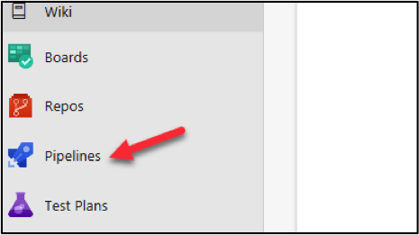
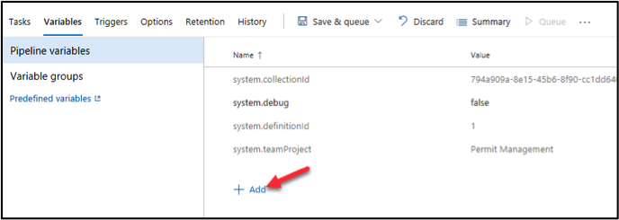

# Admin in a day

# Module 4: Application Lifecycle Management and Deploying Apps

# Hands on lab

# Lab Scenario

In this Hands-on Lab, you are an administrator for Contoso, helping them to adopt the Power Platform.

The team building the Device Order Management app is now ready for you to transport their solution from their development environment to the test environment for testing.

In this lab, you will be using Azure DevOps and the Power Apps build tools to automate checking their solution into a source control repository and then using that to deploy to test and production.

Because this is the first deployment to test, you will have to do some setup to configure security for users to be able to access the app.

# Lab Requirements

## Lab Test Environment

This hands-on lab is designed to be completed in an environment setup for multiple students to complete the Admin in a day series of hands-on labs.

You will be assigned one or more users to use to complete the hands-on tasks. Because this is a shared environment, some tasks that require a tenant Global Administrator or a Service Administrator will already be performed.

This lab assumes you have completed M03_Automation prior to starting this lab.  In that lab you would have created the environment that you will deploy to in this lab.

# Exercise 1: Initialize Azure DevOps

In this exercise, you will be signing up for an Azure DevOps account and configuring the PowerApps build tools for the account.

**Note**:  If you already have Azure DevOps outside of this course and this environment, you CANNOT use that here.  You will need to follow our instructions to sign up.

### Task 1: Signup for Azure DevOps

1)	Navigate to https://dev.azure.com and click Sign in to Azure DevOps.  

**Note**: Use the same account you have been using for the other labs.

2)	Provide your credentials and click **Next**.

3)	Provide a **Password** and click **Sign in**.

4)	Click **Continue**.

5)	Click **Continue**.

6)	If prompted, provide a unique **Azure DevOps Organization** name such as lastnameMMYY, select a location closest to your tenant, enter captcha and click **Continue**. Replace lastname with your last name, MM current month and YY current year.

7)	Enter **Device Management lastnameMMYY** for **Project Name** and click **Create**. Replace lastname with your Last name, MM with current month, and YY with current year.

Projects are containers in Azure DevOps that track work items and source assets. When you set up the automation for the deployment tasks those will be pipelines built in the context of a project.

8)	Select **Repos**.

An Azure Repo is a source/version control container inside the Azure DevOps project used to track changes you make.  You will be using it to store the solution files for the team building the Device Ordering app.

9)	Check the **Add a Readme** checkbox and click Initialize.

### Task 2: Configure Power Platform Build Tasks

1.	Navigate to https://marketplace.visualstudio.com/azuredevops 

2.	Search for **Power Platform**.

3.	Select **Power Platform Build Tools**.

4.	Click **Get it Free**.

5.	Select the **Azure DevOps organization** you created and click **Install**.

6.	Click **Proceed to Organization**.

7.	Click to open the **Device Management** project you created.

# Exercise 2: Build Export Pipeline

In this exercise, you will build an Azure DevOps pipeline that will export the solution from the development Common Data Service environment, unpack the solution file to individual files and then check those files into the repository.  These solution files can be then used to re-create development environments or to promote the solution to test/production. 

### Task 1: Export Solution

1.	Create a Build Pipeline.

      a. Click to expand **Pipelines**.
      
      
      
      b.	Select **Pipelines**.
      
      
      
      c.	Click Create **Pipeline**.
      
      
      
      d.	Click **Use the Classic Editor**.
      
      
      
      e.	Do not change the default values and click **Continue**.
      
      
      
      f.	Select **Empty Job**.
      
      
      
      g.	Click **Save and Queue** and select **Save**.
      
      
      
      h.	Click **Save**.
      
      
      
2.	Add PowerApps Tool Installer task.

    **Note**: The Power Platform Tool Installer needs to be run before any other Power Platform build tasks.

      a.	Click **+ Add Task to Agent Job 1**.
      
      
      
      b.	Search for **Power Platform** hover over select **Power Platform Tool Installer** and click **Add**.
      
      
      
3.	Add Power Platform Export Solution task.
      
      a.	Search for **Export**.

      b.	Hover over **Power Platform Export Solution** and click **Add**.
      
      
      
4.	Open Power Platform Export Solution.

      a.	Select the **Power Platform Export Solution task**.
      
      
      
5.	Get your development environment URL
      
      a.	Start a new browser window or tab and navigate to https://aka.ms/ppac

      b.	Select **Environments** and click to open the **Device Ordering Development** environment.
      
      c.	Copy the **Environment URL** and keep it in your clipboard or you can keep this URL on a notepad.
      
      
      
      d.	Close the **Power Platform Admin** browser window or tab.
      
6.	Create a Generic Service Connection.  Service Connections are how the build tasks know what environment URL and user credentials to use to access the Common Data Service environments.

      a.	Go back to the **Pipeline**.

      b.	Make sure you still have the **Power Platform Export Solution** task selected.

      c.	Click **Manage**.
      
      
      
      d.	Click Create Service Connection.
      
      
      
      e.	Select Generic and then click **Next**.
      
      
      
      f.	Provide a **Connection Name**, paste the **Environment URL** you copied, provide your credentials, and click **Save**.
      
      
      
      g.	Close the **Service Connections** browser window or tab.

7.	Select the Generic Service Connection you created as the Power Apps Environment URL.
      
      a.	Go back to the **Build Pipeline** tasks and make sure you still have PowerApps Export Solution task selected.

      b.	Locate the **Service Connection** field and click **Refresh**.
      
      
      
      c.	Select the **Generic Service Connection** you just created named Dev Connection.
      
      
      
      d.	Enter **$(SolutionName)** for **Solution Name**, **$(Build.ArtifactStagingDirectory)\$(SolutionName).zip** for Solution Output File.
      
      
      
      e.	Click **+Add Task**.
      
      
      
      f.	Add another **Export Solution** task.
      
      
      
      g.	Select **Dev Connection** for the PowerApps Environment URL.

      h.	Check the Export as Managed Solution.

      i.	Enter **$(SolutionName)** for **Solution Name**, **$(Build.ArtifactStagingDirectory)\$(SolutionName)_managed.zip** for **Solution Output File**
      
      
      
8.	Add an Unpack task. This task will take the solution zip file and expand it into a file for each solution component.
      
      a.	Click **+ Add Task**.
      
      
      
      b.	Search for **Unpack**.

      c.	Hover over **PowerApps Unpack Solution** and click **Add**.
      
      
      
9.	Provide Unpack settings information.

      a.	Select the **Unpack** task.

      b.	Enter **$(Build.ArtifactStagingDirectory)\$(SolutionName).zip** for Solution **Input File**, **$(Build.SourcesDirectory)\$(SolutionName)** for **Target Folder**.

      c.	Choose **Both** for Type of Solution.
      
      
      
10.	Allow scripts to access the OAuth Token. This will allow the commands you will add to check in files to the Azure DevOps repo to work.

      a.	Select **Agent Job 1**.
      
      
      
      b.	Scroll down and check the **Allow Scripts to Access the OAuth Token** checkbox.
      
      
      
11.	Add Command Line task.

      a.  Click **+ Add a Task**.
      
      
      
      b.	Search for **Command Line**.
      
      c.	Hover over **Command Line** and click **Add**.
      
      
      
12.	Add Scripts to the Command Line task.  This task will be used to check in the solution file changes to the repo.
      
      a.	Select the Command Line task.
      
      
      
      b.	Paste the script below in the **Script** text area. Replace **user@myorg.onmicrosoft.com** with your username.
      
      "echo commit all changes
      git config user.email "user@myorg.onmicrosoft.com"
      git config user.name "Automatic Build"
      git checkout master
      git add --all
      git commit -m "solution updates"
      echo push code to new repo
      git  -c http.extraheader="AUTHORIZATION: bearer $(System.AccessToken)" push origin master"

      
      
      
13.	Add Solution Name variable.
      
      a.	Select the **Variables** tab.

      b.	Click **+ Add**.
      
      
      
      c.	Enter **SolutionName** for **Name** and **ContosoDeviceOrderManagement** for Value. Confirm that there are no extra spaces at the end of the value after pasting.
      
      
      
      d.	Click **Save and Queue** and select **Save**.

      e.	Click **Save** again.
      
# Exercise 3: Test the Pipeline

In this exercise, you will test the build pipeline you created.

### Task 1: Run the Pipeline

1.	Open the build pipeline.
      
      a.	Navigate to https://dev.azure.com/ and click to open the **Device Management** project.
      
      
      
      b.	Select **Pipelines | Pipelines**.
      
      
      
      c.	Click **Device Management-youruser-CI**.
      
      
      
      d.	Click **Run Pipeline**
      
      
      
      e.	 Select **Run** again and wait.
      
      
      
      f.	Refresh the screen until your Agent job 1 has a Status of **Running**.
      
      
      
      g.	Click on **Agent job 1** to open the job
      
      h.	The build will run up to the Command Line Script and fail because we need to adjust permissions. The first run causes a project specific build service user to be added,           we will adjust the permissions to fix this problem.
      
      
      
      i.	Click **Project Settings** in the lower left corner.
      
      
      
      j.	Select **Repositories**.
      
      
      
      k.	Select the **Permissions** tab.
      
      l.	In the **Users** section, select the **Device Management Build Service** user.
      
      
      
      m.	In the **Access Control Summary**, locate **Contribute** and change it to **Allow**.
      
      
      
      n.	Select **Pipelines | Pipelines** in the left navigation
      
      o.	Click to open the failed run.
      
      
      
      p.	Click **Run Pipeline**.
      
      
      
      q.	Click **Run** and wait
      
      r.	Click to open the job.
      
      
      
      s.	The job should now run successfully
      
      
      
2.	Review the Repository.
      
      a.	Select Repos.
      
      
      
      b.	You should see **ContosoDeviceOrderManagement** folder. Click to open the folder.
      
      
      
      

      
      

   
  
      
      

      
      
      
      
      
   

      
 

 
      
      

