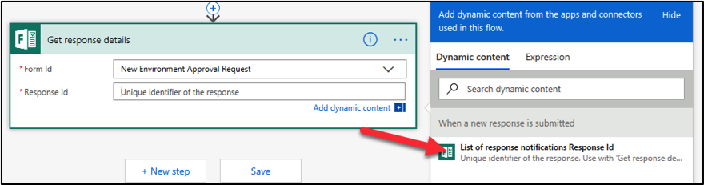
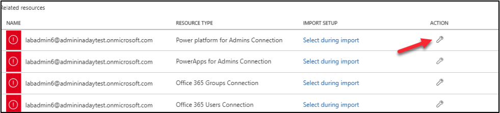
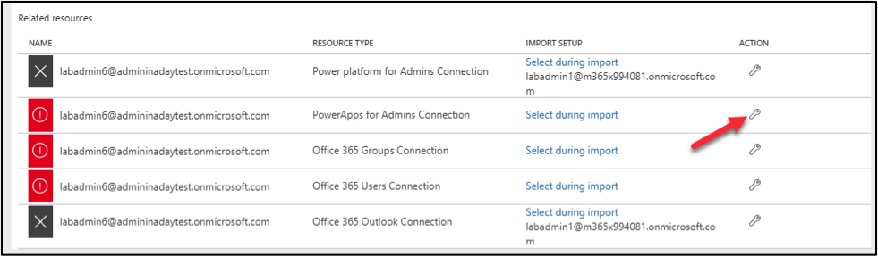

# Admin in a day

# Module 3: Action through Automation

# Hands on lab

# Lab Scenario

In this hands-on lab, you are an administrator for Contoso, helping them to adopt the Power Platform.

Contoso has decided to control creation of Power Platform environments by disabling creation unless you are a global or service admin. Contoso doesn’t want to discourage use of the Power Platform so they would like you to put an automated process in place to allow users to request an environment and a Common Data Service database.

In this lab, you will be building a Microsoft Form to allow users to submit their environment requests. Using the Power Platform administrative connectors and the built-in approval capabilities of Power Automate you will automate the processing of the requests.

The following is an outline of the process you will be implementing:

•	A user submits request via the form including justification for the environment

•	Form submission triggers flow to run

•	Flow uses the approval connector to ask admin team for approval

•	If approved, the environment and CDS database are created

•	User is notified of the outcome; approved or rejected.

This process could easily be expanded to request approval from the user’s manager as well as the request information along with the environment information could be stored for resource usage charge back.

Additionally, you will be installing a pre-created flow that checks for new people building apps and adds them to an Office 365 group and sends them a welcome email.

# Lab Requirements

## Lab Test Environment

This hands-on lab is designed to be completed in an environment setup for multiple students to complete the Admin in a day series of hands-on labs.

You will be assigned one or more users to use to complete the hands-on tasks. Because this is a shared environment, some tasks that require a tenant Global Administrator or a Service Administrator will already be performed.

This lab does not require you have completed any of the prior labs.

# Exercise 1: Create Environment Request Form

## Scenario

In this exercise, you will be creating an environment request form using Microsoft Forms. This form could collect additional information allowing it to be tailored to your individual organization requirements.

### Task 1: Create Microsoft Form

1.	While logged in as the lab admin user navigate to **Microsoft Forms** and close the welcome screen.

2.	Click **New Form**.

2.	Enter **New Environment Approval Request** for title, enter **New environment request** for description, and click **Add new**.

3.	Select **Text**.

4.	Enter **Environment Name**, make the question **Required**, and click **Add New**.

5.	Select **Text** again.

6.	Enter **Business Justification**, select **Long Answer**, and make it **Required**.

7.	Click **Add New** and select **Text**.

8.	Enter **What connectors will you use**? select **Long Answer** and make it **Required**.

9.	The form will be saved automatically.

10.	Click **Preview**

11.	Your form should look like the image below.

# Exercise 2: Create Flow

## Scenario

In this exercise, you will be building the automated flow to process new form submissions.

Note: for the purposes of this exercise we have hard-coded the language, currency and environment template. The Power Platform Administration connector has actions allowing you to dynamically retrieve these and make the process more flexible. In fact, you could allow the user to specify the values, or infer them from the user’s Office 365 profile information using the Office 365 connector.

### Task 1: Create New Environment Approval Flow

1.	Logged in with your **Lab Admin** user, navigate to Power Automate, and login with your admin user.

2.	Confirm that your environment is set to **Power Platform CoE**. 
Note: This environment is where our CoE starter kit is installed and is intended to be our dedicated admin environment.  Even if you don’t use the starter kit, having a dedicated admin environment can be helpful.

3.	Select **My flows**.

4.	Click **+ New** and select **Automated from Blank**.

5.	Type **New Environment Approval** in the Flow name field.

6.	In the **Choose your flow’s trigger** section, search for Microsoft Forms, select When a new response is submitted, and click **Create**.

7.	Select **the New Environment Approval Request** form you created and click **+ New Step**.

8.	Search for **Microsoft Forms** and select **Get Response Details**.

9.	Select **New Environment Approval Request** for Form Id and click on the **Response Id** field.

10.	Select **List of Response Notifications Response Id** from the Dynamic content pane.

11.	Click **+ New step**.

12.	Search for **Approvals** and select **Start and Wait for an Approval**.

13.	Select **First to Respond** for **Approval Type**.

14.	Enter **Environment Approval Requested** for Title.

15.	Select the user you are logged in as for **Assigned to**.

16.	Type **New Environment was requested by**: in the **Details** field.

17.	Select **Responders**’ **Email** from the Dynamic content pane.

18.	Hit the enter key and type **Environment Name**: and select **Environment Name** from the Dynamic content pane.

19.	Hit the enter key again and type **Business Justification**: and select **Business Justification** from the Dynamic content pane.

20.	Hit the enter key again and type **Connectors**: and select **What connectors will you use**? from the Dynamic content pane.

21.	Click **+ New step**.

22.	Select **Condition** Control.

23.	Click on the Choose a value field and select **Outcome**.

24.	Enter **is equals** to for condition, enter **Approve** for value, and click **Add an action** in the **Yes** branch.

25.	Search for **Power Platform** and select **Power Platform for admins**.

26.	Select **Create Environment (preview)**.

27.	Enter unitedstates for the **location** and click on the **Display Name** field.
Note: Location determines the region for the environment, in a real process you might allow this to be auto determined by the user location or something the requester provides.

28.	Select **Environment Name** from the Dynamic content pane.

29.	Select **Trial** for **Environment Sku**.  

30.	Click **Save**. Do not navigate away from this page.

### Task 2: Create Database and Notify User

1.	Click **Add Action** under Create Environment.

2.	Search for **Power Platform** and select **Create CDS Database (preview)**.

3.	Click on the **Environment Name** dropdown and select **Enter Custom Value**.

4.	Select Name from the Dynamic content pane.

5.	Enter **1033** for Base Language and enter **USD** for Currency Code.

6.	Enter **D365_CDSSampleApp** for Template Item.

7.	Click **Add an action**.

8.	Search for **Send Email** and select **Send an email (V2) Office 365 Outlook**.

9.	Click on the **To**: field and select **Responder’s Email** for the Dynamic Content pane.

10.	Enter **Your environment was created** for **Subject**.

11.	Enter **Environment** in the **Body** field and select **Display Name** from the Dynamic Content pane under the **Create Environment** step.

12.	Add **was created**.

13.	Your email should look like the image below.

14.	Go to the **No** branch and click Add an Action.

15.	Search for Send email and select **Send an email (V2) Office 365 Outlook**.

16.	Click on the **To**: field and select **Responder’s Email** from the Dynamic Content pane.

17.	Type **Rejected environment request** for **Subject**.

18.	Enter **Your request for new environment was rejected** in the **Body**.

19.	Your email should now look like the image below.

20.	Click **Save**.

21.	Click **Flow Checker** and make sure there are no errors.

22.	Close the **Flow Checker** pane.

23.	Click on the **Back** button.

### Task 3: Test the Flow

1.	Navigate to Microsoft Forms and click to open the form you created.

2.	Click **Share** and **Copy** the link.

3.	Paste the link in the browser and navigate to it.

4.	The form should load. Provide an Environment Name of **Central Apps Test** and Business Justification.  Note: For the purposes of this course, we will be using this environment we created here later in another lab to deploy the Device Ordering solution using Azure Dev Ops, for that lab it will serve as the Test environment that is why we are suggesting naming it Central Apps Test.  In real word use, most likely it would be a team/project development environment that would be requested using a form like this.

5.	Click **Submit**.

6.	Go back to **My flows** list and open the flow you created.

7.	You should see the flow running. Click to open it.

8.	The flow is waiting for the approval.

9.	Start a new browser tab and navigate to Outlook. 

10.	You should have approval request email, click to open it.

11.	Click **Approve**.

12.	Click **Submit**.

13.	Go back to the flow browser tab.

14.	The flow should succeed.

15.	Navigate to Power Platform admin center  and select Environments. The new environment should be listed there.

16.	You should also get an email.

17.	You may test for request rejection if you like.

# Exercise 3: Creating Data Policies

In this exercise, you will be creating exception policies for the environment you just created that will control what connectors can be used in those environments.

The following are the steps to create a policy that is an exception to the global tenant policy:

•	Exclude from the global tenant policy the environment that you are building an exception for. We have already completed that in this tenant.

•	Create an environment specific DLP configured with the connectors allowed by the exception.

To know what connectors to include in the Business Data only section of the DLP we have reviewed what was requested on the request form and have met with the team building the Device Ordering app to further clarify their connector needs. Any negotiation of data and security policies at Contoso would happen at this time. We have discovered that for this app Office 365 Outlook, Approval and Common Data Service connectors will be used.

### Task 1: Create a DLP for Test

1.	Navigate to Power Platform admin center 

2.	Select **Data policies** tab in the left navigation.

3.	Click **New policy**.

4.	Enter **Central Apps Test – Lab Admin (Your Number)** for **Name** and select **Connectors** or click **Next**.

5.	Select **Common Data Service** and click **Move to Business**. Select the Common Data Service and not the Common Data Service (Current Environment).

6.	Select **SharePoint** and click **Move to business**.

7.	Select **Approvals** and click **Move to business**.

8.	Select **Office 365 Outlook** and click **Move to business**.

9.	Select **Twitter** and click **Block**. We will not allow the Twitter connector.

10.	Click **Next**.

11.	Select **Central Apps Test** (or whatever you named the environment you just created in the prior exercise) and click **Add to policy**. If you were a global tenant admin you would also see options to include or exclude and apply to all environments but since you are not, you only see the option to pick a single environment.

12.	Click **Next**.

13.	Review and click **Create policy**.

# Exercise 4: Welcome New Makers (Optional if you have time)

### Task 1: Create Office 365 Group

1.	Navigate to Azure portal 

2.	Select **Azure Active Directory**.

3.	Select **Groups**.

4.	Click **+ New Group**.

5.	Select **Office 365** for Group Type, enter **Lab Admin Your# Makers** for Group Name, **select Assigned** for Membership Type and click **Create**.

6.	Open the group after it gets created.

7.	Select **Properties** and copy the **Object ID**.

8.	Paste the object ID to a notepad, you will need it in future step.

### Task 2: Import Flow

1.	Navigate to Power Automate 

2.	Make sure **Power Platform COE** environment is selected.  Note: While we are using the Personal productivity in your own tenant you might do this in an admin focused environment or where you have installed the CoE Starter Kit.

3.	Select My **Flows** and click **Import**.

4.	Click **Upload**.

5.	Select the **Send Welcome Email** zip file and click **Open**. This will be in your lab resource files you downloaded named SendWelcomeEmailToNewPowerAppsMakers_20190529192359.zip

5.	Click Configure for the flow.

6.	Select **Create as new** and click **Save**.

7.	Click **Configure** for **Power Platform for Admin Connection**.

6.	Select the available connection and click **Save**.

7.	Click Action for **Office 365 Outlook Connection**.

8.	Select the available connection and click **Save**.

9.	Click **Configure** for **Power Apps for Admin Connection**.

10.	Click select the available connection and click **Save**.

11.	Click **Configure** for **Office 365 Group Connection**.

12.	Click **Create new**.

13.	Click **+ New connection**.

14.	Search for **Office 365 Groups** and click **Add**.

15.	Click **Create**.

16.	Login with your maker credentials.

17.	You should now have the connections listed in the image below.  

18.	Go back to the Flow import.

19.	Click **Refresh list**, select the connection you just added, and click **Save**.

20.	Click Action for **Office 365 Users Connection**.

21.	Select the available connection and click **Save**.

22.	Click **Import** and wait for the import it to complete.

23.	The flow should import successfully.

### Task 3: Edit and Test Flow

1.	Navigate to Power Automate and make sure you have the **Power Platform CoE** environment selected.

2.	Select My **Flows**.

3.	Locate the flow you imported and click **Edit**.

4.	Expand the **Recurrence** and make sure the flow is set to run once a day.

5.	Expand the **Office Group ID** step.

6.	Clear the current **Group ID**.

7.	Copy the **Group ID** from your notepad and paste it here. 

8.	You may examine the steps of the flow.

9.	Click **Save**.

10.	Click on the back button.

11.	Click **Run**.

12.	Click **Run Flow**.

13.	Click **Done**.

14.	**Refresh**.

15.	Your flow run should succeed.

16.	Go back to Azure portal 

17.	Select **Azure Active Directory**.

18.	Select **Groups** and open the group you created.

19.	Select **Members**. You should have at least one member.

20.	Navigate to Outlook .

21.	You should get a welcome email. Open the email. If you don’t get an email, it is probably because you didn’t create an application in the past 24 hours, create a new Power App and run the flow again.

# Terms of Use

© 2020 Microsoft Corporation. All rights reserved.

By using this demo/lab, you agree to the following terms: The technology/functionality described in this demo/lab is provided by Microsoft Corporation for purposes of obtaining your feedback and to provide you with a learning experience. You may only use the demo/lab to evaluate such technology features and functionality and provide feedback to Microsoft. You may not use it for any other purpose. You may not modify, copy, distribute, transmit, display, perform, reproduce, publish, license, create derivative works from, transfer, or sell this demo/lab or any portion thereof. COPYING OR REPRODUCTION OF THE DEMO/LAB (OR ANY PORTION OF IT) TO ANY OTHER SERVER OR LOCATION FOR FURTHER REPRODUCTION OR REDISTRIBUTION IS EXPRESSLY PROHIBITED. THIS DEMO/LAB PROVIDES CERTAIN SOFTWARE TECHNOLOGY/PRODUCT FEATURES AND FUNCTIONALITY, INCLUDING POTENTIAL NEW FEATURES AND CONCEPTS, IN A SIMULATED ENVIRONMENT WITHOUT COMPLEX SET-UP OR INSTALLATION FOR THE PURPOSE DESCRIBED ABOVE. THE TECHNOLOGY/CONCEPTS REPRESENTED IN THIS DEMO/LAB MAY NOT REPRESENT FULL FEATURE FUNCTIONALITY AND MAY NOT WORK THE WAY A FINAL VERSION MAY WORK. WE ALSO MAY NOT RELEASE A FINAL VERSION OF SUCH FEATURES OR CONCEPTS. YOUR EXPERIENCE WITH USING SUCH FEATURES AND FUNCTIONALITY IN A PHYSICAL ENVIRONMENT MAY ALSO BE DIFFERENT.

## FEEDBACK

If you give feedback about the technology features, functionality and/or concepts described in this demo/lab to Microsoft, you give to Microsoft, without charge, the right to use, share and commercialize your feedback in any way and for any purpose. You also give to third parties, without charge, any patent rights needed for their products, technologies and services to use or interface with any specific parts of a Microsoft software or service that includes the feedback. You will not give feedback that is subject to a license that requires Microsoft to license its software or documentation to third parties because we include your feedback in them. These rights survive this agreement. MICROSOFT CORPORATION HEREBY DISCLAIMS ALL WARRANTIES AND CONDITIONS WITH REGARD TO THE DEMO/LAB, INCLUDING ALL WARRANTIES AND CONDITIONS OF MERCHANTABILITY, WHETHER EXPRESS, IMPLIED OR STATUTORY, FITNESS FOR A PARTICULAR PURPOSE, TITLE AND NON-INFRINGEMENT. MICROSOFT DOES NOT MAKE ANY ASSURANCES OR REPRESENTATIONS WITH REGARD TO THE ACCURACY OF THE RESULTS, OUTPUT THAT DERIVES FROM USE OF DEMO/ LAB, OR SUITABILITY OF THE INFORMATION CONTAINED IN THE DEMO/LAB FOR ANY PURPOSE.
DISCLAIMER

## DISCLAIMER

This demo/lab contains only a portion of new features and enhancements in Microsoft PowerApps. Some of the features might change in future releases of the product. In this demo/lab, you will learn about some, but not all, new features.

